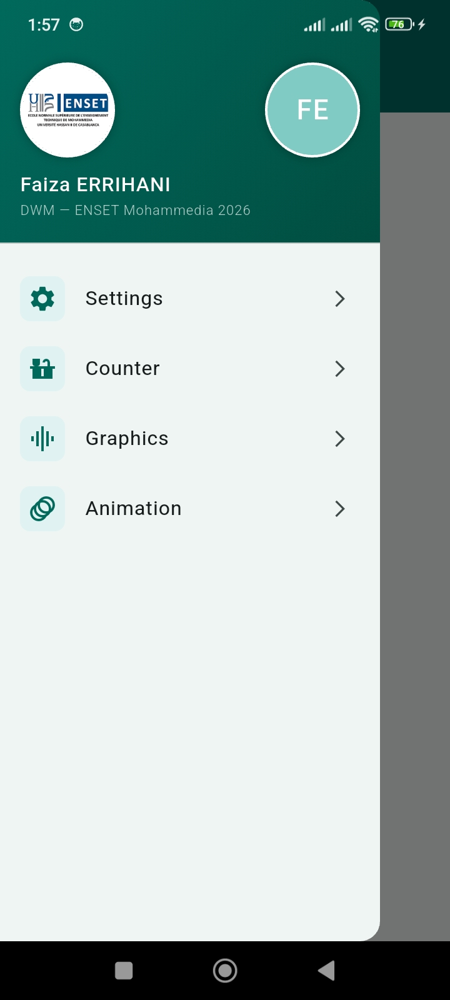
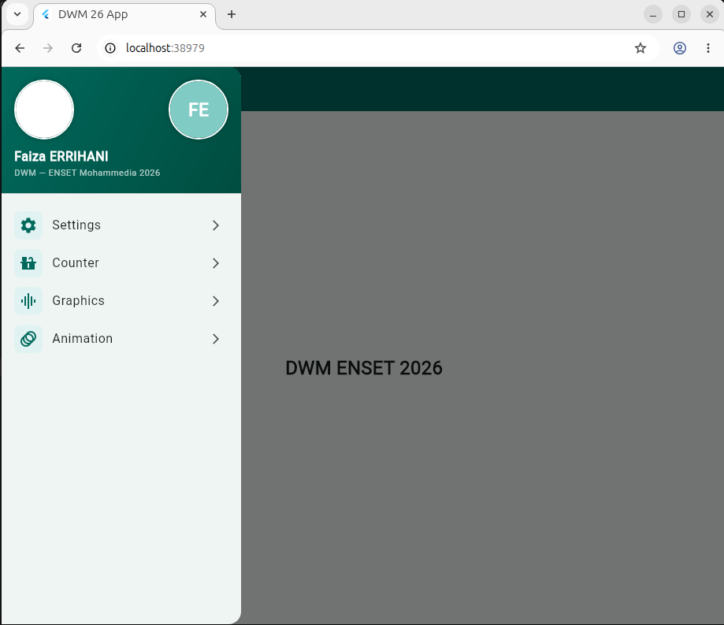
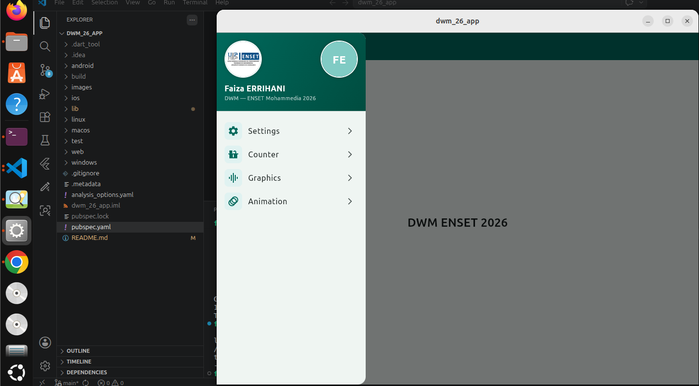

# 📱 dwm_26_app

[](https://flutter.dev)
[](https://dart.dev)
[](https://android.com)

> Application Flutter Cross-Platform développée dans le cadre du cours **DWM**  
> ENSET Mohammedia — Université Hassan II de Casablanca

---

## 👩‍🎓 Auteur

| Nom | Filière | École | Année | Professeur |
|-----|---------|-------|-------|------------|
| Faiza ERRIHANI | DWM | ENSET Mohammedia | 2025/2026 | Mohamed Youssfi |

---

## 📸 Captures d'écran

### 🤖 Android 


### 🐧 Linux Desktop


### 🌐 Chrome Web


```

## 📁 Structure du projet
dwm_26_app/
├── images/
│   ├── logo.png
│   └── profile.png
├── lib/
│   ├── main.dart
│   ├── pages/
│   │   ├── home.page.dart
│   │   ├── counter.page.dart
│   │   ├── settings.page.dart
│   │   ├── graphics.page.dart
│   │   └── animated.graphics.page.dart
│   └── widgets/
│       ├── main.drawer.widget.dart
│       ├── shape.painter.widget.dart
│       └── animated.shape.painter.widget.dart
└── pubspec.yaml

```

## ✅ Plateformes testées

| Plateforme | Device | Statut |
|-----------|--------|--------|
| 🐧 Linux Desktop | Ubuntu 26.04 | ✅ OK |
| 🌐 Chrome Web | Google Chrome 148 | ✅ OK |
| 🤖 Android | Xiaomi Redmi 13C API 34 | ✅ OK |

---

## 🚀 Fonctionnalités

- ✅ **Home Page** — Page d'accueil avec AppBar teal
- ✅ **Drawer** — Menu latéral avec logo ENSET + avatar
- ✅ **Counter Page** — Compteur interactif +/-
- ✅ **Settings Page** — Page de paramètres
- ⏳ **Graphics Page** — CustomPaint + Slider
- ⏳ **Animation Page** — Animations avec sliders

---

## ▶️ Installation

```bash
git clone https://github.com/faizaERRIHANI/dwm_26_app.git
cd dwm_26_app
flutter pub get
flutter run
```

---

## 🔗 Ressources

- 📺 [Vidéo du cours](https://www.youtube.com/watch?v=DZoXID80NiE)
- 👨‍🏫 [Repo du prof](https://github.com/mohamedYoussfi/flutter-dwm-enset-part1)
- 📖 [Flutter Docs](https://docs.flutter.dev)

---

*Projet réalisé dans le cadre de l'Activité Pratique N°1 — DWM ENSET Mohammedia 2025/2026*  
**Faiza ERRIHANI**
